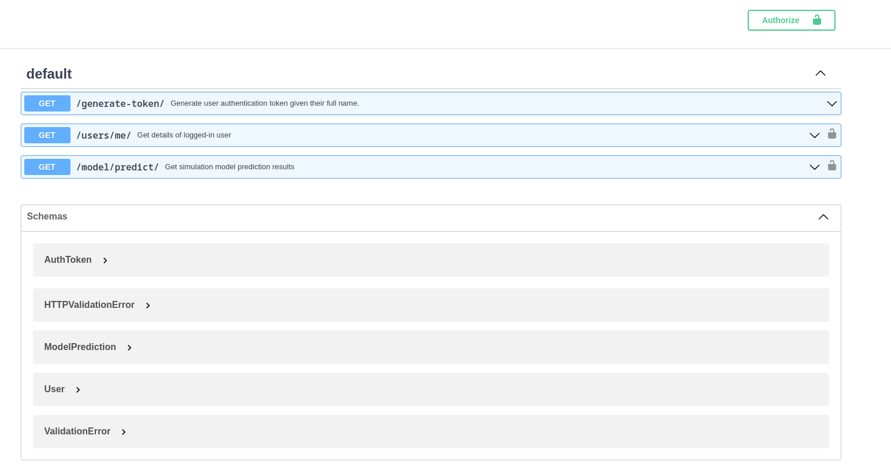
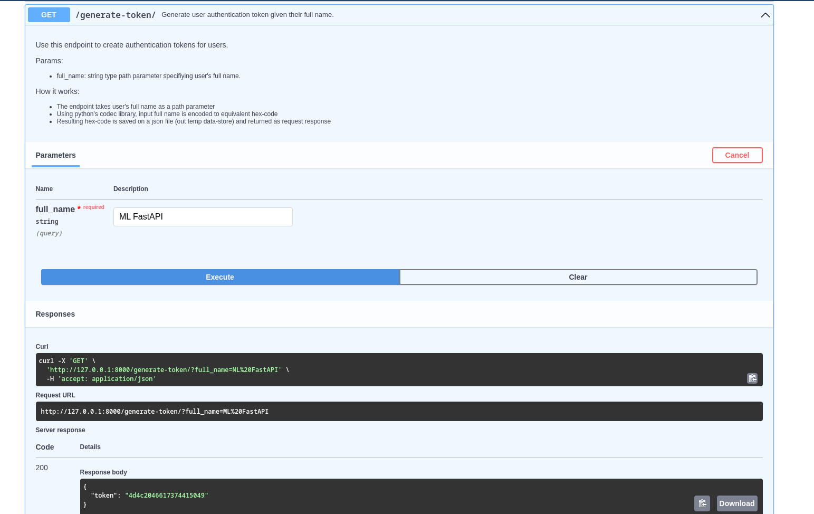
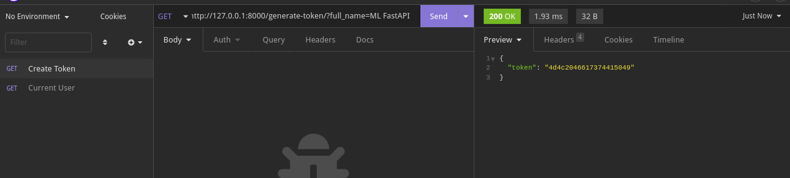
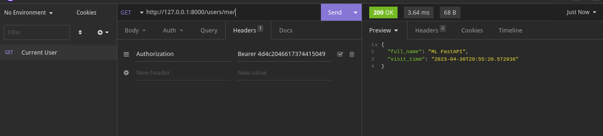
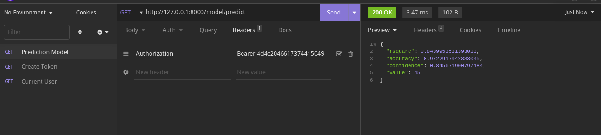

# FastAPI and Scikit Learn for Machine Learning Deployment

> Project Abstract

## Bearer Authentication  

Please refer to [this fastapi page](https://fastapi.tiangolo.com/tutorial/security/simple-oauth2/) for elaborate explanation.  

Bearer authentication is an HTTP authentication scheme that involves security tokens called bearer tokens. The name “Bearer authentication” can be understood as “give access to the bearer of this token.” The bearer token is a cryptic string, usually generated by the server in response to a login request. The client must send this token in the Authorization header when making requests to protected resources:

`Authorization: Bearer <token>`  

## How Bearer Authentication  Works  

The Bearer Token is created for the user/client by the Authentication server. In order to access a protected API endpoint, the user/client must provide the Access Token. Access tokens are short lived (around an hour). A Refresh Token if used to pro-long lifetime of an access token.  

[read more here](https://swagger.io/docs/specification/authentication/bearer-authentication/) and [here](https://www.devopsschool.com/blog/what-is-bearer-token-and-how-it-works/)

## Running the Basic Auth App

Application swagget documentation looks as below.
  

Follow these steps to run the application.

- Install dependencies  
  `poetry install`

- Run the app  
  `poetry run uvicorn auth_app.main:app --reload`

- Generate access token by executing a `GET` requent on endoint `/generate-token/`
  

  [Insomnia API Client](https://insomnia.rest/download) can also be used.

  

- Get logged-in user details. Note how access token is provided using headers. **swagger docs will not work for this endpoint as `/auth/token` endpint (which is supposed to translate username/password login to access token) is not implemented.
  

- Generate mock-up prediction model outputs  
    
  